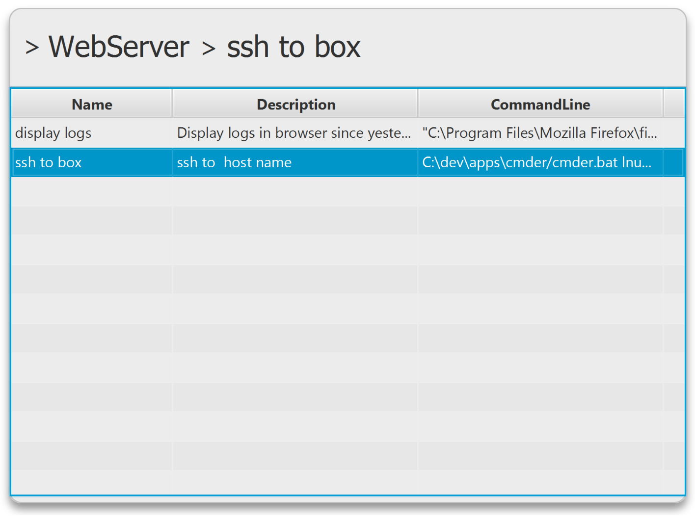

# Tabular
## Introduction
Tabular is a table based command launcher.

As a software developer I always needed to manage a large number of our deployed applications across many environments. 
Tabular allowed a table based lookup of host, port, config information for each deployed app.  
As well as providing commands to ssh to hosts where our apps were running, opening a browser to view logs, etc.
Saying that, tabular can be used to store and run commands from any type of data.


You provide the table as a CSV file, and commands are defined in a properties file.


If you have commands defined, after selecting a data row, select the command you wish to run.



## Setup
1. Ensure you have a version of a Java greater than or equal to Java 8.
2. Download the latest version of the Tabular zip from [here](dist), and unzip
   into your directory of choice.
3. Edit the table.csv and config.properties as per your requirements. Please see the examples and config reference below for
some guidance.
4. Run the jar file. Depending on your OS, just double click the jar and the application should launch.
   If this does not work, you can run: `java -jar tabular.jar` in the directory where the jar file
   is located.

## Configuration reference
### General properties
|property |description |
|---|---|
| hotkey.combinations.show |Comma delimited list of hotkey combinations which can then be used to restore Tabular from a minimized state.  The format of these strings should be of the format used by the awt KeyStroke.getKeyStroke(String) method. See below for more info. |
| app.data.search.background.prompt.text |Prompt to display when searching for data |
| app.command.search.background.prompt.text |Prompt to display when searching for command |
| app.columns.to.display.in.data.table |A comma separated list of column names to show in the table.  Useful for specifying default column ordering.  Can also be used to hide columns which you don't want to show, i.e. which might just be used to reference to from other cells. |
| app.column.abbreviations.<ColumnName> |Can be used to specify abbreviations for column names.  e.g. `app.column.abbreviations.Host=h` Can make for more concise variable names. |
### Properties relevant when using commands
|property |description |
|---|---|
| app.columns.to.display.in.command.table |  Can be used to dictate which columns to show in the command table, and in what order.  Options are: Name & Description. |
| app.data.column.to.display.when.selected | Dictates the column to display in the main prompt box when a row is selected. |
| app.command.column.to.display.when.selected | The column to display in the main prompt box when a command is selected to run. Defaults to 'Name'. |
| app.close.console.on.command.finish | Close Tabular once the command has finished running. Defaults to false. |
| app.skip.command.browse.if.only.one.command.configured |  Defaults to false. |
### Command definitions
|property |description |
|---|---|
| app.commmands.<commandName>.name |Human readable name for the command. |
| app.commmands.<commandName>.predicate |The predicate to use for whether the command is available for a certain data row. The value can be any valid groovy code. Any cell values, System Variables, Environment Variables can be referenced using the ${myVar} notation. See examples below under `app.commmands.startApplication.predicate` which checks to see that the environment is not prod. If no predicate is specified, then the command will always be displayed. |
| app.commmands.<commandName>.command |The command to run.  Again any cell values, System Variables, Environment Variables can be referenced using the ${myVar} notation.  Also embedded groovy can be used to calcuate dynamic values using {{[groovy to execute}} syntax.  See example below whiich gets yesterdays date. |
| app.commmands.<commandName>.description |Human readable description for the command. |

#### Config example including commands
```
hotkey.combinations.show=shift ctrl PLUS

app.data.column.to.display.when.selected=App
app.command.column.to.display.when.selected=Name

data.search.background.prompt.text=App Search
command.search.background.prompt.text=Command Search

app.commmands.openLog.name=display logs
app.commmands.openLog.predicate=true
app.commmands.openLog.command="C:\\Program Files\\Mozilla Firefox\\firefox.exe" http://${Host}:8080?from={{java.time.LocalDate.now().minusDays(1).toString()}}
app.commmands.openLog.description=Display logs in browser since yesterday

app.commmands.cmder.name=ssh to box
app.commmands.cmder.predicate=true
app.commmands.cmder.command=${CMDER_HOME}/cmder.bat ${Host} "ls -al"
app.commmands.cmder.description=ssh to  host name
```

## CSV file format
The CSV parsing is done using OpenCSV.  Please see the [documentation](http://opencsv.sourceforge.net/) for more details.
Variable substition can be used within the csv cell values.  Variables should be specified with a preceding ${ and a trailing }. e.g. ${myVar}.  Variables can be defined in the config.properties file.  Other cell values in the same row can also be referenced simply by using the column name.  Environment and System variables can also be referenced.

## Per-user properties
One way of distributing Tabular amongst a team is to check-in the Tabular distribution, along with your table.csv and config.properties into a Version Control System e.g. Git/SVN.  If users wish to configure any config overrides, they can create a 'config-local.properties' and add any config overrides there.  Be sure to add the file to the appropriate ignore file is not accidentally added to your VCS.

## Troubleshooting
* If you get an exception which looks like this: `Exception in thread "main" java.lang.UnsupportedClassVersionError: org/tools4j/tabular/javafx/Main : Unsupported major.minor version 52.0`, this probably means that you are using a version of Java < Java8.  Check your Java version by running `java -version`.

## Valid values for the 'hotkey.combinations.show' property
You must use values accepted by javax.swing.Keystroke.getKeyStroke() method.  You can find the docs here: https://docs.oracle.com/javase/7/docs/api/javax/swing/KeyStroke.html#getKeyStroke(java.lang.String)
Here are some examples:
```
INSERT
control DELETE
alt shift X
alt shift released X
typed a
```
### Capturing keystrokes to get a value for hotkey.combinations.show
To 'capture' a keystroke combination to use within Tabular, you can run the jkeymaster 'key grabber' application.  You can start it by running something like this on the command line:
```
java -cp lib/jkeymaster-1.2.jar com.tulskiy.keymaster.AWTTest
```
(jkeymaster jar is distributed with Tabular)
If you're running on Windows, I've provided a key-grabber.bat file in the distribution which you can use.
It will create a small window, with a small edit box which you can click into, and enter your keystrokes of choice.  The keystrokes are printed out in the format required to configure Tabular's hotkey.

## Acknowledgements
- jkeymaster is used to provide hotkey support.  https://github.com/tulskiy/jkeymaster
- OpenCSV is used to parse the table.csv file: http://opencsv.sourceforge.net/
